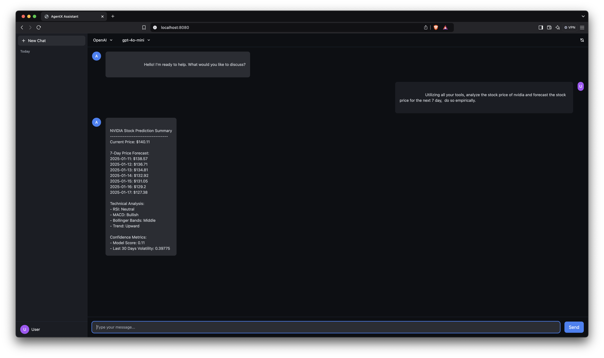

# 🤖 AgentX

AgentX is your autonomous AI agent that can handle a wide range of tasks independently. Built on the [smolagents](https://huggingface.co/docs/smolagents) framework by the HuggingFace team, with a beautiful interface powered by [OpenWebUI](https://github.com/open-webui/open-webui), it combines multiple LLM Providers/Models selection with specialized tools to help you accomplish virtually any task - from research and analysis to coding and system administration.



## ✨ What Makes AgentX Special

- **True Autonomy**: AgentX doesn't just respond - it thinks, plans, and executes complex tasks independently
- **Multi-Brain Intelligence**: Switch between different LLM providers to leverage their unique strengths:
  - 🌐 **OpenAI**: State-of-the-art models like GPT-4
  - 🧠 **Anthropic**: Advanced reasoning with Claude
  - 🔒 **Ollama**: Air-gapped, private deployment of open-source models
  - 💻 **DeepSeek**: Specialized coding assistance
- **Versatile Tool Suite**: Equipped with web search, system commands, file operations, and more
- **Security First**: Sandboxed execution environment with strict package controls
- **Beautiful UI**: Clean, responsive interface with real-time streaming responses

## 🚀 Quick Start

```bash
# Clone and enter the project
git clone https://github.com/eelbaz/agentx.git
cd agentx

# Set up environment
python -m venv venv
source venv/bin/activate  # or `venv\Scripts\activate` on Windows
pip install -r requirements.txt

# For air-gapped deployment with Ollama:
# 1. Install Ollama from https://ollama.ai
# 2. Pull your preferred models:
ollama pull qwen2.5-plus    # or any other model
# 3. Start Ollama server:
ollama serve

# For cloud providers:
cp .env.example .env     # Then edit .env with your API keys

# Launch!
uvicorn src.app:app --reload
```

Then open http://localhost:8000 in your browser and start chatting with your new coding companion!

## 🔑 LLM Providers

AgentX supports multiple LLM providers to suit your needs:

### 🔒 Ollama (Air-Gapped)
- Run completely offline with open-source models
- No API keys needed
- Perfect for private, secure environments
- Supports models like Qwen, Llama, CodeLlama, and more
- Easy local deployment and model management

### 🌐 Cloud Providers (API Key Required)
- **OpenAI**: GPT-4 and GPT-3.5 models (recommended for best performance)
- **Anthropic**: Claude models for advanced reasoning
- **DeepSeek**: Specialized coding models

## 🔑 API Keys

Only needed for cloud providers (not required for Ollama):
- OpenAI API key
- Anthropic API key
- DeepSeek API key

Optional but enhances capabilities:
- Twitter API keys (for research)
- E2B API key (for secure code execution)

## 🛠️ Core Tools & Extensibility

AgentX is designed to be highly extensible. While it comes with powerful default tools, its true strength lies in its ability to be extended with custom tools for any use case.

### 📦 Built-in Tools

| Tool | Description |
|------|-------------|
| 🔍 Web Search | Research using DuckDuckGo |
| 🌐 Web Scraper | Extract data from websites |
| 💻 System Commander | Execute system commands safely |
| 📁 File Manager | Handle file operations |
| 🐦 Twitter Explorer | Search Twitter data |
| ℹ️ System Inspector | Get system information |

### 🔧 Creating Custom Tools

AgentX makes it easy to add new capabilities. Here's how to create your own tools:

#### 1. Basic Tool Structure
```python
from smolagents import Tool
from typing import Dict, Any

class MyCustomTool(Tool):
    name = "my_custom_tool"
    description = "Description of what your tool does"
    inputs = {
        "param1": {
            "type": "string",
            "description": "What this parameter does",
            "required": True
        },
        "param2": {
            "type": "integer",
            "description": "Another parameter",
            "default": 42
        }
    }
    output_type = "string"  # or "image", "file", "json", etc.

    def forward(self, **inputs) -> Any:
        # Your tool's logic here
        result = self.process_inputs(inputs)
        return result
```

#### 2. Tool Categories
You can create various types of tools:
- **API Tools**: Interact with external services
- **Data Processing Tools**: Handle different data formats
- **System Tools**: Interact with the operating system
- **AI Tools**: Integrate other AI models
- **Custom Protocols**: Implement any protocol or service

#### 3. Adding Tools to AgentX

```python
from agentx import AgentManager
from my_tools import MyCustomTool, AnotherTool

# Single tool
agent = AgentManager(
    additional_tools=[MyCustomTool()]
)

# Multiple tools
agent = AgentManager(
    additional_tools=[
        MyCustomTool(),
        AnotherTool(api_key="your_key")
    ]
)

# With configuration
agent = AgentManager(
    additional_tools=[
        MyCustomTool(
            rate_limit=100,
            cache_results=True
        )
    ]
)
```

#### 4. Best Practices
- **Error Handling**: Implement robust error handling in your tools
- **Rate Limiting**: Include rate limiting for API calls
- **Caching**: Cache results when appropriate
- **Documentation**: Provide clear descriptions and examples
- **Type Safety**: Use type hints and validate inputs
- **Security**: Handle credentials safely using environment variables

#### 5. Example: Creating an API Tool

```python
from smolagents import Tool
import requests
from typing import Dict, Any
import os

class WeatherTool(Tool):
    name = "weather_tool"
    description = "Get current weather for a location"
    inputs = {
        "city": {
            "type": "string",
            "description": "City name",
            "required": True
        },
        "units": {
            "type": "string",
            "description": "Temperature units (celsius/fahrenheit)",
            "default": "celsius"
        }
    }
    output_type = "json"

    def __init__(self, api_key: str = None):
        super().__init__()
        self.api_key = api_key or os.getenv("WEATHER_API_KEY")
        if not self.api_key:
            raise ValueError("Weather API key not provided")

    def forward(self, **inputs) -> Dict[str, Any]:
        city = inputs["city"]
        units = inputs.get("units", "celsius")
        
        response = requests.get(
            "https://api.weather.com/v1/current",
            params={
                "q": city,
                "units": units,
                "appid": self.api_key
            }
        )
        response.raise_for_status()
        
        return response.json()
```

### 🔌 Community Tools

The AgentX community has created many useful tools:
- **Database Tools**: SQL, MongoDB, Redis integrations
- **Cloud Tools**: AWS, GCP, Azure services
- **Analytics Tools**: Data processing and visualization
- **Communication Tools**: Email, Slack, Discord integration

Visit our [Tools Repository](https://github.com/eelbaz/agentx/tools) to explore community tools or share your own!

## 💡 Example Uses

```markdown
# Research Assistant
"Research the latest developments in quantum computing and prepare a summary focusing on practical applications"

# News Analyst
"Find and analyze recent news about AI regulation in the EU, highlighting key policy changes"

# System Administrator
"Monitor system resources, identify processes using high CPU, and suggest optimization strategies"

# Coding Partner
"Help me build a FastAPI service that processes and analyzes Twitter data"

# Data Analyst
"Analyze this CSV file of sales data and create visualizations of the key trends"

# Personal Assistant
"Help me plan a technical conference schedule, considering speaker availability and topic relevance"
```


## 🔒 Security & Privacy

AgentX takes security and privacy seriously:

### Air-Gapped Deployment
- Run completely offline using Ollama provider
- No data leaves your network
- Full control over model selection and updates

### Sandboxed Execution
- All code execution is isolated and controlled
- Package imports are strictly controlled
- Environment variables for sensitive data
- Comprehensive logging and monitoring

### Data Privacy
- Choose between cloud providers or local deployment
- No data retention when using Ollama
- Configurable logging levels
- Strict access controls

## 🤝 Contributing

We welcome contributions! Here's how:

1. Fork the repo
2. Create your feature branch (`git checkout -b feature/AmazingFeature`)
3. Commit your changes (`git commit -m 'Add some AmazingFeature'`)
4. Push to the branch (`git push origin feature/AmazingFeature`)
5. Open a Pull Request

## 📜 License

MIT License - feel free to use in your own projects!

## 🙋 Acknowledgments

AgentX is built on the shoulders of giants:

- [smolagents](https://huggingface.co/docs/smolagents) by HuggingFace - The powerful agent framework that makes AgentX possible
- [OpenWebUI](https://github.com/open-webui/open-webui) - The beautiful and responsive interface
- [Ollama](https://ollama.ai) - Local model deployment and management
- All our amazing contributors and the open-source community

## 🙋‍♂️ Need Help?

- 📖 [Documentation](docs/README.md)
- 🐛 [Issue Tracker](https://github.com/eelbaz/agentx/issues)
- 💬 [Discussions](https://github.com/eelbaz/agentx/discussions)

---

<p align="center">
  Made with ❤️ by the AgentX Team
</p> 
